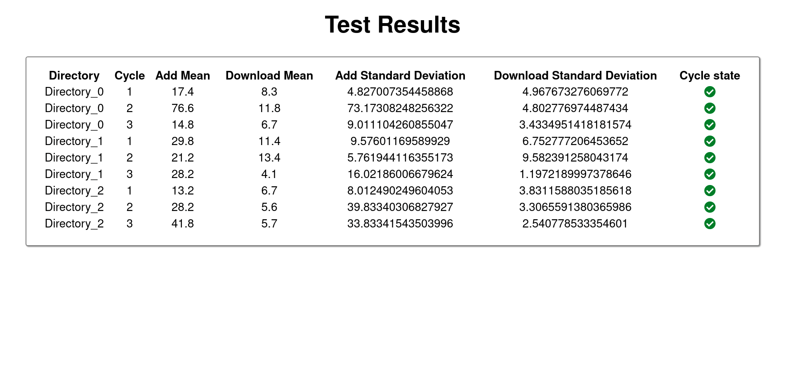

# FileSystemService
A web service for remote filesystem management.

## Table of Contents

- [References](#references)
- [Screenshots](#screenshots)
- [Requirements](#requirements)
- [Dependencies](#dependencies)
- [Running](#running-for-test)


## References

Javadoc is available at:

Docs/apidoc-ejb (EJB documentation)

Docs/apidoc-web  (REST service and web application documentation)


## Screenshots





## Requirements

- Java8EE
- maven-compiler-plugin 3.1


## Dependencies

- `jackson-annotations 2.6.0`
- `jackson-databind 2.6.7.1`
- `javaee-api 7.0`
- `javaee-web-api 7.0`
- `jersey-container-servlet-core 2.12`
- `jersey-media-multipart 2.13`


## Running for Test

#### 1 - Download or clone the project
```bash
git clone https://github.com/orazioscavo13/FileSystemService.git
```

#### 2 - Open the project with Netbeans
#### 3 - Select "Build with Dependencies" on main module.
#### 4 - Run Homework1-ear


#### 5 - Select and configure Web Server and environment
When you run the project for the first time you will need to select a web server. 

The project has been successfully tested on Glassfish Server 4.1 on ArchLinux, it may not work properly on some other platform.


NB: Depending on the web server you may need to change the port to the REST service in the frontend and in the RequestSender used by LoadGeneratorServlet (default is 43636):

- change the value of the attribute 'port' at RequestSenderService.java (line 28)
- change the value of the port in the baseUrl string in the js controller for the frontend page, mainController.js (line 10)
