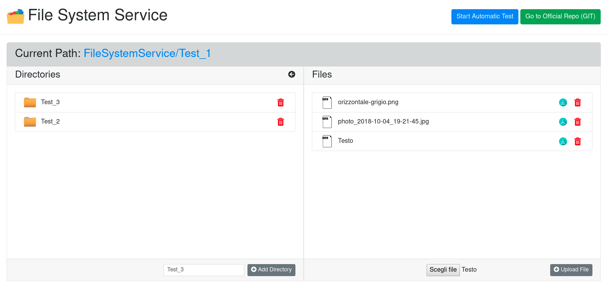
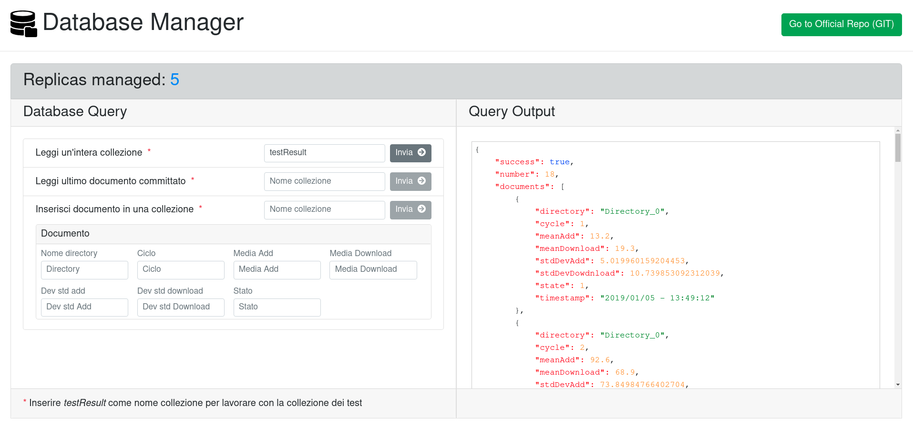

# FileSystemService
A web service for remote filesystem management.

## Table of Contents

- [References](#references)
- [Screenshots](#screenshots)
- [Requirements](#requirements)
- [Dependencies](#dependencies)
- [Running with Docker](#running-for-production)
- [Testing](#running-for-test)


## References

Javadoc is available at:

- Docs/apidoc-EJB (**EJB** documentation)

- Docs/apidoc-WEB  (**REST service** and **web application** documentation)

- Docs/apidoc-DBanager  (**DB Writer/Reader** documentation)

- Docs/apidoc-ReplicaManager  (**Replica Manager** documentation)


## Screenshots






## Requirements

- Java8EE
- maven-compiler-plugin 3.1
- MongoDB
- rabbitMQ-server


## Dependencies

- `jackson-annotations 2.6.0`
- `jackson-databind 2.6.7.1`
- `javaee-api 7.0`
- `javaee-web-api 7.0`
- `jersey-container-servlet-core 2.12`
- `jersey-media-multipart 2.13`
- `rabbitMQ amqp-client 5.5.1`
- `mongo-java-driver 3.4.1`

## Running for Production

>NB: Before you follow this guide you need to have a working installation of **Docker** on your host!

#### 1 - Clone the project from master branch
```bash
git clone https://github.com/orazioscavo13/FileSystemService.git
```
#### 2 - Build the project
- Open projects on Netbeans (Homework1, DatabaseManager, ReplicaManager)
- In the **projects** panel, right click and select **Build with Dependencies** on main module (**Homework-1**), on **DatabaseManager** module and in **ReplicaManager** module.

#### 3 - Run the project
```bash
cd FileSystemService
sudo docker-compose up
```
>NB: The image building process requires to download heavy docker images, and can take several minutes

#### 4 - Open the web pages
Now you can navigate to:
- http://localhost:8080/Homework1-web/ (**FileSystemService** frontend)
- http://localhost:43637/DatabaseManager-1.0-SNAPSHOT/ (**DatabaseManager** frontend)
- http://localhost:43638/ReplicaManager-1.0-SNAPSHOT/ (**ReplicaManager** frontend)

## Running for Test
You can clone this project and simply run it without starting any docker container, so you can work on it and test it easily and quickly.
>NB: Before you follow this guide you need to have a working installation of **Glassfish Server**, **MongoDb** and **Rabbitmq-Server** on your host!
#### 1 - Clone the project from develop branch
```bash
git clone --branch develop https://github.com/orazioscavo13/FileSystemService.git
```

#### 2 - Run the RabbitMQ Server
- on Windows:
Run **RabbitMQ Service - start** from start menu

- on Linux:
 ```bash
sudo rabbitmq-server start
```
> NB: you will need to enter your password to run the server


#### 3 - Run the Database
- on Windows:
Go to Mongodb installation folder and run **mongo.exe**

- on Linux:
```bash
sudo systemctl start mongodb.service
```
>NB: The command can change depending on the distribution

#### 4 - Build the project
- Open projects on Netbeans (Homework1, DatabaseManager, ReplicaManager)
- In the **projects** panel, right click and select **Build with Dependencies** on main module (**Homework-1**), on **DatabaseManager** module and in **ReplicaManager** module.


#### 5 - Run the project
In the Netbeans **projects** panel, Right click and select **Run** on **Homework1-ear**, **ReplicaManager**, **Database Manager** (Follow this order to avoid runtime errors!)
>NB: When you run the project for the first time you will need to select a web server. 
The project works on **Glassfish Server 4.1.1** and has been tested on **ArchLinux** and **Windows 10 Home**, it may not work properly on some other platform.

#### 6 - Configure the environment
Depending on the environment you may need to change the port to the REST services in some points of the project (project default is glassfish default port **8080**):
- change the value of the attribute 'port' at Homework1-web/RequestSenderService.java (line 28)
- change the value of the port in the 'baseUrl' string at Homework1-web/web-pages/mainController.js (line 10)
- change the value of the port in the 'baseUrl' string at DatabaseManager/web-pages/mainController.js (line 14)
- change the value of the port in the url to the unique replica managed in DatabaseManager/TransactionManager (line 38)

#### 7 - Open the web pages
Now you can navigate to:
- http://localhost:8080/Homework1-web/ (**FileSystemService** frontend)
- http://localhost:8080/DatabaseManager/ (**DatabaseManager** frontend)
- http://localhost:8080/ReplicaManager/ (**ReplicaManager** frontend)

>NB: The port can be different, look at point 6
